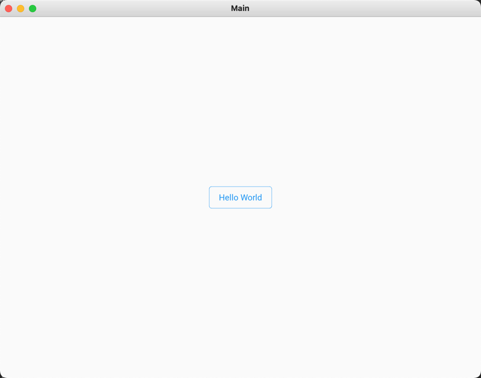

# Simple Android App Built Using Python

## Technologies
`Python`  
`Conda`  
`Kivy`

This was built use to demonstrate that you can use Python to develop an Android app. However, this does not build the app, nor does it demonstrate how to push it to the Android Play Store. 

